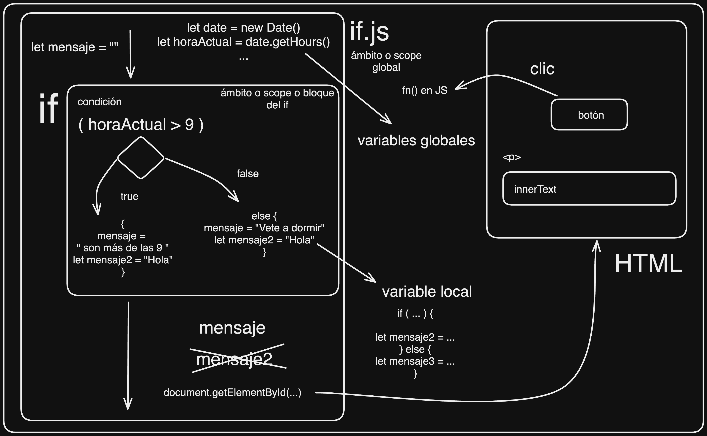
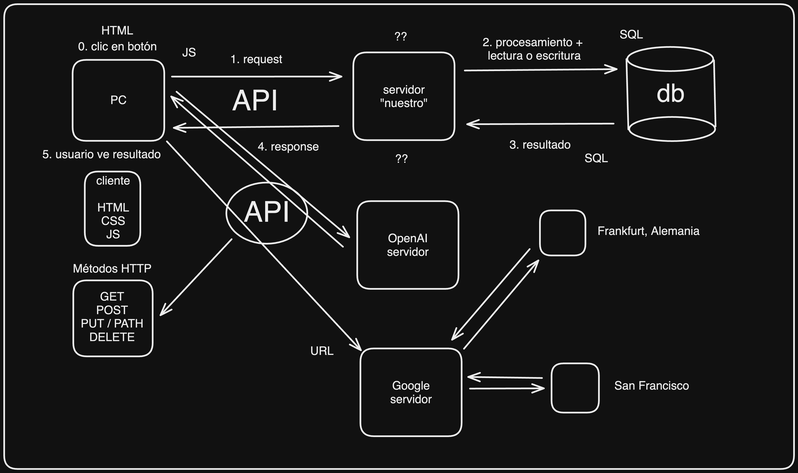

# IFCT0609_CEN
Repositorio de la formación IFCT0609_CEN

## Primeros pasos
Para clonar este repositorio, ejecutar el siguiente comando:
```
git clone https://github.com/cesarlpb/IFCT0609_CEN.git
```
**Para actualizar:**
Primero, debes estar en la carpeta del repositorio (donde hiciste `git clone`), y ejecutar:
```
git pull
```

## Sintaxis Markdown

- [Documentación Markdown](https://www.markdownguide.org/cheat-sheet/)

# Javascript

## Bucles

### Diagrama de Variables, Scope y Bucle If


### If
[Ejercicios de bucle If](https://javascript.espaciolatino.com/evaluar/condicionales_1.htm)

### Switch
[Ejercicios de bucle Switch](https://javascript.espaciolatino.com/evaluar/condicionales_2.htm)

### For
[Ejercicios de bucle For](https://javascript.espaciolatino.com/evaluar/bucles_for.htm)

### While
[Ejercicios de bucle While](https://javascript.espaciolatino.com/evaluar/bucles_while.htm)
### Do While
[Ejercicios de bucle Do While](https://javascript.espaciolatino.com/evaluar/bucles_do_while.htm)

## API

### Diagrama sobre el funcionamiento de APIs y los request / responses con `fetch()` de Javascript



APIs que hemos utilizado:

- API de objetos de tipo `todo`, `posts`, `comentarios`, etc. ->[https://jsonplaceholder.typicode.com/](https://jsonplaceholder.typicode.com/)
- Fake API  de Platzi con `productos`, `usuarios`, etc. -> [https://api.escuelajs.co/docs](https://api.escuelajs.co/docs)