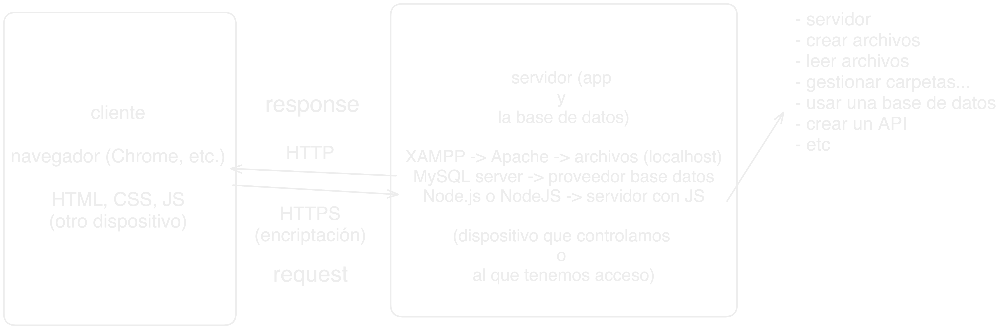
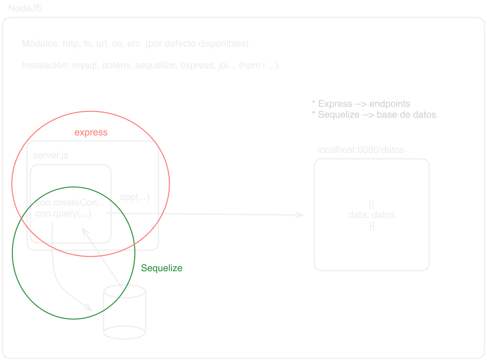

## Recursos

En descripción, temas 1, 2 y 5, el de `npm` lo revisaremos de nuevo.

## Diagramas

## Express y Sequelize

- [Ejemplo Express](https://medium.com/@onejohi/building-a-simple-rest-api-with-nodejs-and-express-da6273ed7ca9) en [express](./express/)
- [Ejemplo Sequelize](https://www.digitalocean.com/community/tutorials/how-to-use-sequelize-with-node-js-and-mysql) en [sequelize](./sequelize/)
- JWT

