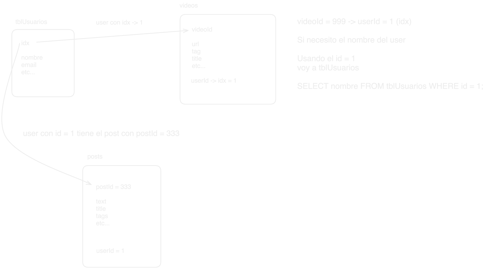

# SQL y MySQL

## Documentación

[Tipos de datos](https://dev.mysql.com/doc/refman/8.0/en/data-types.html)

## Ejercicios de SQL

[Ejercicios de MySQL](https://parzibyte.me/blog/2018/02/06/ejercicios-resueltos-consultas-sql-mysql/amp/)

Ejercicios por bloques:

- [Bloque 1](1.bloque1.sql)
- [Bloque 2](2.bloque2.sql)
- [Bloque 3](3.bloque3.sql)
- [Bloque 4](4.bloque4.sql)

## Creación de base de datos

Ejecutamos estos queries: [crear base de datos](0.crear_db.sql)

## Diagramas
Esquema de relaciones entre tablas en una base de datos relacional.

Esquema de flujo de datos en una aplicación web.

