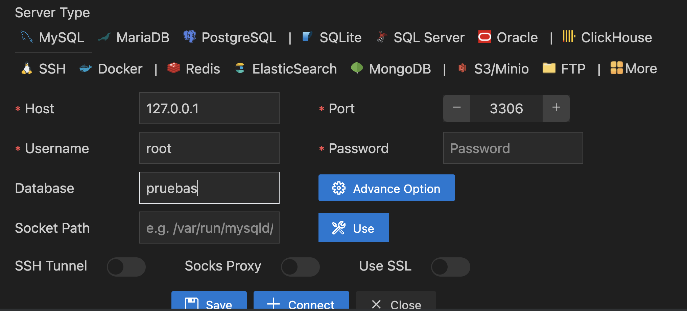
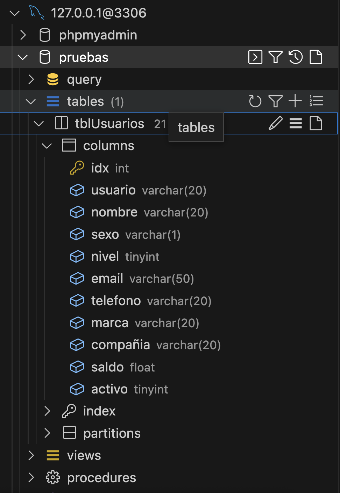
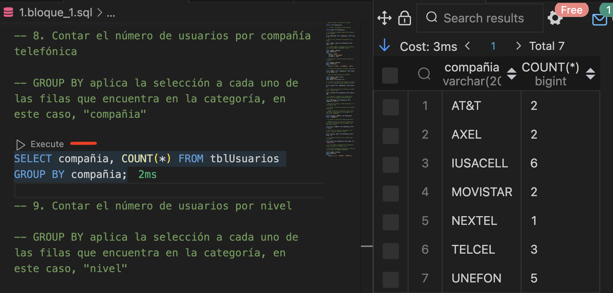

# SQL y MySQL

[Teoría en W3Schools](https://www.w3schools.com/sql/)

## Documentación

[Tipos de datos](https://dev.mysql.com/doc/refman/8.0/en/data-types.html)

## Creación de base de datos

**Pasos para crear una base de datos y la tabla para los ejercicios:**

1. Iniciar XAMPP -> `Apache` y `MySQL`. Una vez iniciados los procesos -> Click en botón: `Abrir aplicación` (`Go to application`). Navegamos a `phpMyAdmin`: [http://localhost/phpmyadmin/index.php](http://localhost/phpmyadmin/).
2. Vamos a la pestaña `SQL` y ejecutamos el query: [crear base de datos, tabla e insertar datos](0.crear_db.sql). Una vez que hemos creado la base datos y tabla, debemos ver en estas pestañas: 
  - `Examinar` los datos
  - `Estructura` la tabla con los tipos de las columnas (`int`, `varchar`, `date`, etc.)
  - `SQL` el query que hemos ejecutado. **Aquí** ejecutamos queries directamente en esta base de datos, por ejemplo:
  ```sql
  SELECT * FROM tblUsuarios;
  ```
3. En `phpMyAdmin` podemos editar, borrar y leer los datos usando el interfaz gráfico. Además, podemos **previsualizar el SQL** que se va a ejecutar antes de confirmar.

## Extensión MySQL en VS Code

Estamos usando esta extensión: `cweijan.vscode-mysql-client2`

1. Cuando instalamos la extensión aparece un icono de base de datos en el panel lateral. Hacemos click para añadir conexión.
2. Click en `Create Connection` y colocamos la base datos que vamos a usar, en este caso, `pruebas`:


3. Click en `Connect`. Deberíamos ver la conexión en el panel:


4. Comprobamos que vemos la tabla `tblUsuarios` en el panel lateral:



5. Ahora podemos ejecutar queries desde cualquier archivo `.sql` usando `Execute`:



**Recomendaciones:**
  - Se puede editar el nombre de la conexión haciendo click derecho > Edit connection en el panel lateral.
  - Crear y borrar conexiones es rápido, podemos tener una activa en cada momento. 

## Ejercicios de SQL

[Ejercicios de MySQL](https://parzibyte.me/blog/2018/02/06/ejercicios-resueltos-consultas-sql-mysql/amp/)

Ejercicios por bloques:

- [Bloque 1](1.bloque1.sql)
- [Bloque 2](2.bloque2.sql)
- [Bloque 3](3.bloque3.sql)
- [Bloque 4](4.bloque4.sql)

## Más Ejercicios

- [Parte 1 - SELECT (es lo anterior)](https://parzibyte.me/blog/2018/02/06/ejercicios-resueltos-consultas-sql-mysql/)
- [Parte 2 - teoría UPDATE y DELETE](https://parzibyte.me/blog/2018/02/12/ejercicios-mysql-cadena-update-delete/)
- [Parte 3 - teoría de algunas funciones](https://parzibyte.me/blog/2018/02/23/mas-ejercicios-resueltos-mysql-combinando-funciones/)
- [Parte 4 - Fechas](https://parzibyte.me/blog/2020/12/28/ejercicios-resueltos-mysql-4/)

## Diagramas
Esquema de relaciones entre tablas en una base de datos relacional.


Esquema de flujo de datos en una aplicación web.

